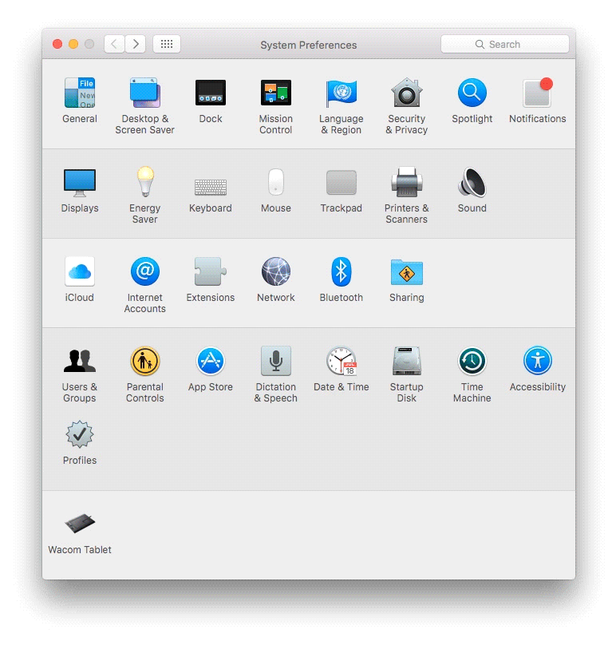

# Move It
A Sketch plugin that forces you to name a group before you make it. I originally made this for myself, as I needed help cleaning up my layers panel. I was hoping that through some pavlovian training, I would be able to turn the plugin off after a few months and stay in the habit of naming my groups. 

## Installation
1. Download plugin
2. Double click the GroupIt.sketchplugin file.
3. That's it.

## Keyboard Shortcut Override 
1. Navigate to custom keyboard set up in Keyboard `System Preferences ▸ Keyboard ▸ Shortcuts ▸ App Shortcuts`
3. Add a new shortcut
4. Select Sketch from the application dropdown and input  `Group It` into the Menu Title
2. Use the shortcut <kbd>cmd</kbd> + <kbd>G</kbd> to override the regular Group action.
4. Click Add.

## Using the Plugin
1. Select the layers that you wish to group. 
2. Using the shortcut <kbd>cmd</kbd> <kbd>G</kbd>, group the layers.
3. Enter a group name in the modal.
4. You're all set.

## Contact
Twitter: <a href="http://twitter.com/brockmdonaldson" target="_blank">@brockmdonaldson</a>  
Portfolio Site: <a href="http://brockdonaldson.co" target="_blank">brockdonaldson.co</a>

